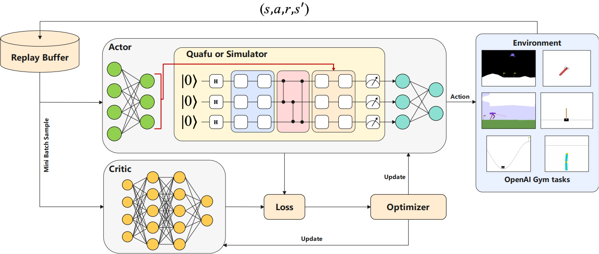
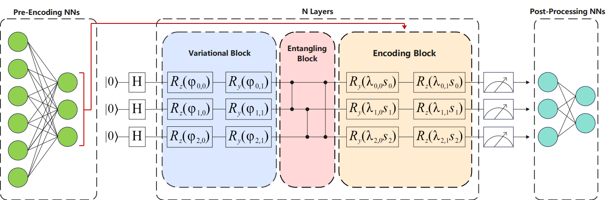
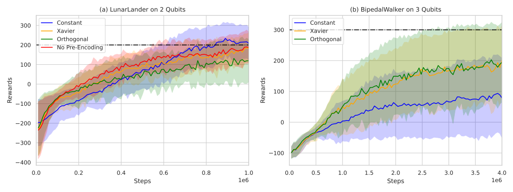
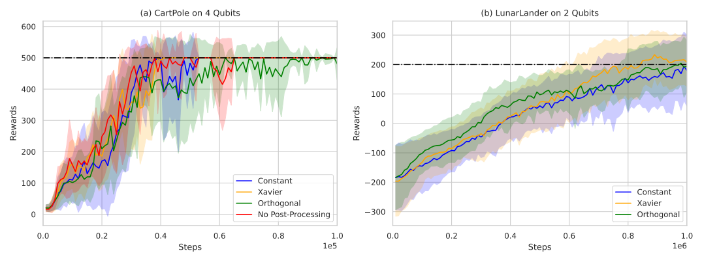
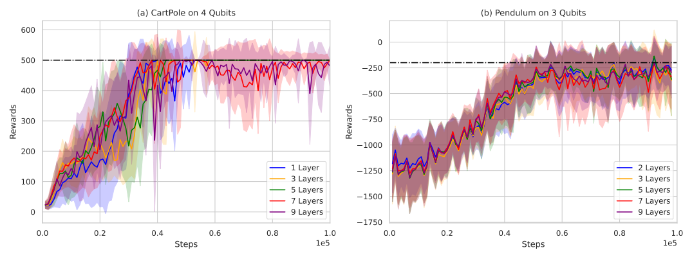
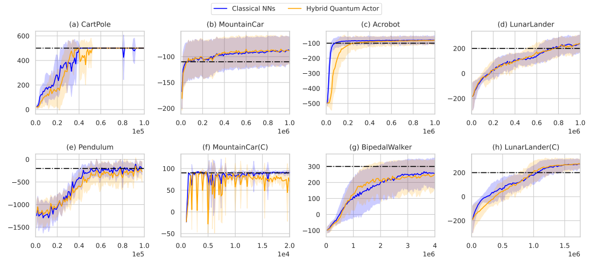
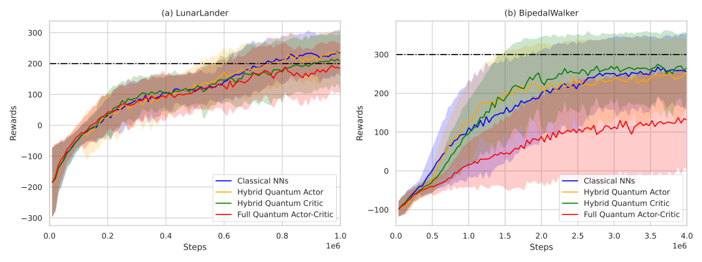
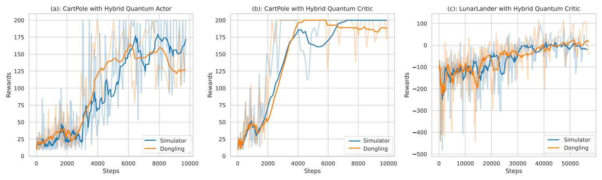
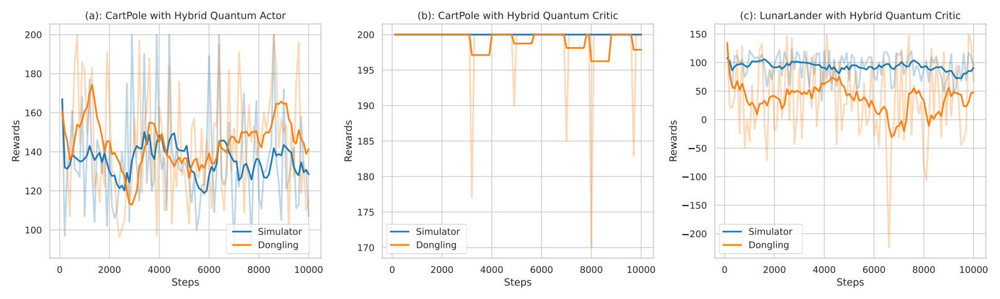

# PPO-Q: Quantum-Classical Proximal Policy Optimization for Reinforcement Learning

PPO-Q is a hybrid quantum-classical reinforcement learning algorithm based on the Proximal Policy Optimization (PPO) framework. By integrating parameterized quantum circuits into the Actor or Critic modules, PPO-Q addresses challenges in environments with high-dimensional state spaces and continuous action spaces.

## Key Features

- **Hybrid Quantum-Classical Architecture**: Combines quantum circuits with classical neural networks to enhance model generalization capabilities.
- **Efficient Parameter Optimization**: Achieves comparable performance to traditional PPO while significantly reducing the number of training parameters.
- **NISQ Hardware Compatibility**: Demonstrates successful training on superconducting quantum devices via the Quafu cloud service.
- **State-of-the-Art Results**: Successfully tackled the BipedalWalker environment, a first for quantum reinforcement learning.

---

## Framework Overview

The overall framework of PPO-Q demonstrates the integration of quantum and classical components. 

### FIG. 1: PPO-Q Framework

The framework illustrates an example where the actor is implemented using Parameterized Quantum Circuits (PQCs) and the critic is a classical neural network (NN). The quantum actor interacts with environments from OpenAI Gym, filling the replay buffer with a set of data (s, a, r, s′). A mini-batch is then sampled to update parameters within the PPO algorithm.



---

### Hybrid Quantum-Classical Architecture

PPO-Q employs a hybrid architecture that uses both quantum and classical components. Below is an example of the proposed hybrid architecture using three qubits.

### FIG. 2: Hybrid Quantum-Classical Architecture

This figure demonstrates the detailed hybrid quantum-classical design, highlighting the interaction between quantum circuits and classical networks.



---

## Setup

Before running the project, make sure you have the required dependencies installed. Use the following commands to set up the environment:

```bash
# Ensure the Python version is 3.10
pip install --editable ./torchquantum
pip install quarkstudio==7.0.5
pip install gymnasium[box2d]==0.29.1

---

## Training Reinforcement Learning Models

### Usage

To train the model, execute the following command:

```bash
python main.py <config_file_name>
```

- Replace `<config_file_name>` with the desired configuration file name (excluding the `.yaml` extension).  
- For example, to train the model on the `LunarLander` environment, use:

  ```bash
  python main.py LunarLander
  ```

- If no configuration file name is provided, the default `CartPole.yaml` configuration will be used.

---

## Results

PPO-Q has been evaluated on 8 diverse environments, including 4 with continuous action spaces, demonstrating performance on par with classical methods. The algorithm achieves efficient training and robustness, paving the way for quantum reinforcement learning in complex control tasks.


### Learning Curves with Pre-Encoding Neural Networks
FIG. 3 shows the learning curves of agents using pre-encoding NNs with different initialization strategies on LunarLander-v2 and BipedalWalker-v3. The solid line represents the mean of ten seeds, and the shaded area indicates the standard deviation.



---

### Learning Curves with Post-Processing Neural Networks
FIG. 4 illustrates the learning curves of agents using post-processing NNs with different initialization strategies on CartPole-v1 and LunarLander-v2. The interpretation of the lines is similar to FIG. 3.



---

### Variational Quantum Layers Comparison
FIG. 5 compares the performance of different numbers of variational quantum layers on CartPole-v1 and Pendulum-v1. The lines are interpreted similarly to FIG. 3. Recording begins when the agent reaches the goal.



---

### PPO-Q vs Classical PPO
FIG. 6 compares the performance between PPO-Q and classical PPO across eight environments. The orange line represents the hybrid quantum actor, while the blue line represents the agent with classical NNs. The shaded area indicates the standard deviation.



---

### Quantum Schemes Performance Comparison
FIG. 7 showcases the performance of all quantum schemes compared with classical NNs on LunarLander-v2 and BipedalWalker-v3. The green line indicates the hybrid quantum critic, while the red line represents the full quantum actor-critic.



---

### Training Performance on Simulators and Real Hardware
FIG. 8 demonstrates the training performance of CartPole-v0 with hybrid quantum actor and critic schemes, and LunarLander-v2 with a hybrid quantum critic, on both simulators and Dongling quantum devices.



---

### Inference on Simulators and Real Hardware
FIG. 9 illustrates the inference process of trained agents on both simulators and Dongling. The solid line represents the moving window average.



---

PPO-Q paves the way for solving more sophisticated reinforcement learning problems using quantum-classical methods. For further details, please explore the repository. Contributions and feedback are welcome!


## Additional Data

For additional experimental data, including detailed results and raw outputs, please check the [results archive](./results/results.zip).

PPO-Q paves the way for solving more sophisticated reinforcement learning problems using quantum-classical methods. For further details, please explore the repository. Contributions and feedback are welcome!
