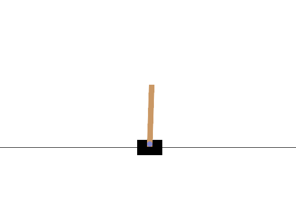
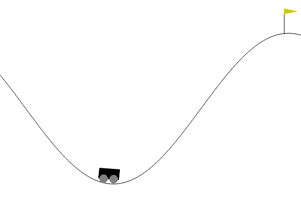

# PPO-Q: Quantum-Classical Proximal Policy Optimization for Reinforcement Learning

PPO-Q is a hybrid quantum-classical reinforcement learning algorithm based on the Proximal Policy Optimization (PPO) framework. By integrating parameterized quantum circuits into the Actor or Critic modules, PPO-Q addresses challenges in environments with high-dimensional state spaces and continuous action spaces.

---

## Setup

Before using this project, ensure that you have the following dependencies installed:

```bash
# Ensure that the Python version is 3.10
pip install --editable ./third_party/torchquantum
pip install quarkstudio==7.0.5
pip install gymnasium[box2d]==0.29.1
```

---

## Training Reinforcement Learning Models

### Usage

To train the model, run the following command:

```bash
python main.py <config_file_name>
```

- Replace `<config_file_name>` with the desired config file name (without the `.yaml` extension).  
- For example, to use the `LunarLander` environment, you can run:

  ```bash
  python main.py LunarLander
  ```

- If no config file name is provided, the default configuration `CartPole.yaml` will be used.

### Modifying Training Parameters

You can modify the training parameters by editing the respective YAML file in the `config/` folder. Below are the configurable parameters with example values:

| Parameter          | Description                                                                 | Example Value    |
|--------------------|-----------------------------------------------------------------------------|------------------|
| `env_name`         | Name of the reinforcement learning environment.                            | `LunarLander-v2` |
| `n_steps`          | Number of steps per environment per update.                                 | 1024             |
| `mini_batch_size`  | Size of the mini-batch.                                                     | 64               |
| `max_train_steps`  | Maximum number of training steps.                                           | 1,750,000        |
| `lr_a`             | Learning rate for the actor network.                                        | 0.003            |
| `lr_c`             | Learning rate for the critic network.                                       | 0.0003           |
| `gamma`            | Discount factor.                                                           | 0.999            |
| `lamda`            | GAE parameter.                                                              | 0.98             |
| `epsilon`          | PPO clip parameter.                                                         | 0.2              |
| `K_epochs`         | Number of PPO epochs.                                                       | 4                |
| `entropy_coef`     | Entropy coefficient.                                                        | 0.01             |
| `num_envs`         | Number of environments to run in parallel.                                  | 16               |
| `normalize_state`  | Whether to normalize the state.                                             | False            |
| `normalize_reward` | Whether to normalize the reward.                                            | False            |
| `clip_decay`       | Whether to decay the clipping parameter.                                    | False            |
| `lr_decay`         | Whether to decay the learning rate.                                         | False            |
| `ini_method`       | Initialization method (0 to 11). Represents quantum initialization methods. | 4                |
| `seed`             | Random seed.                                                                | 42               |
| `n_blocks`         | Number of blocks in the quantum reinforcement learning network.             | 1                |
| `n_wires`          | Number of qubits in the quantum circuit.                                    | 4                |

Example:
- To modify the `LunarLander` configuration, open the file at `config/LunarLander.yaml` and change the parameters as needed.

---

## Training Results

During the training process, results are saved in the `./runs` directory, which can be visualized using TensorBoard:

```bash
tensorboard --logdir=runs
```

The model and normalization parameters will be saved in the `./weights/discrete` directory for further analysis or testing.

---

## Environments

PPO-Q has been tested and shown to perform well in popular benchmark environments, including:

| Environment       | State Space Dimension | Action Space Dimension |
|:-----------------:|:---------------------:|:----------------------:|
| **CartPole**      | 4                     | 2                      |
| **MountainCar**   | 2                     | 3                      |
| **Acrobot**       | 6                     | 3                      |
| **LunarLander**   | 8                     | 4                      |
| **MountainCarC**  | 2                     | 1                      |
| **Pendulum**      | 3                     | 1                      |
| **LunarLanderC**  | 8                     | 2                      |
| **BipedalWalker** | 24                    | 4                      |

---

## Generating Visualizations

If you want to create visualizations or generate publication-quality figures, you can refer to the **`results on simulator.ipynb`** file in the `example` folder. This notebook provides step-by-step instructions to:

1. Load the training data or inference results.
2. Customize and generate various plots.
3. Save figures for use in presentations or publications.

To use the notebook:
- Open the `results on simulator.ipynb` file in Jupyter Notebook.
- Modify the provided scripts to fit your specific requirements.
- Run the cells to generate the desired plots.

For example, you can create training curves, environment visualizations, or performance comparisons using this notebook.

To run the notebook, ensure that Jupyter is installed:

```bash
pip install jupyter
```

---

## Visualization of Inference Results

The following images show the results of running PPO-Q on different environments:

|            **CartPole**            |           **Acrobot**            |           **LunarLander**            |
|:----------------------------------:|:--------------------------------:|:------------------------------------:|
|  |  |  |

| **MountainCarC**       |          **Pendulum**           | **BipedalWalker**      |
|:----------------------:|:-------------------------------:|:----------------------:|
|  |   |  |


---

### How to Perform Inference Locally

If you want to perform inference locally, refer to the **`inference.ipynb`** file in the `example` folder.  

If you want to run it, you need to install Jupyter:

```bash
pip install jupyter
```

## Contribution

Contributions are welcome! Feel free to open issues, contribute code, or report bugs. If you have any questions, please open an issue on GitHub.
